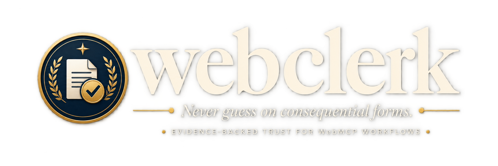
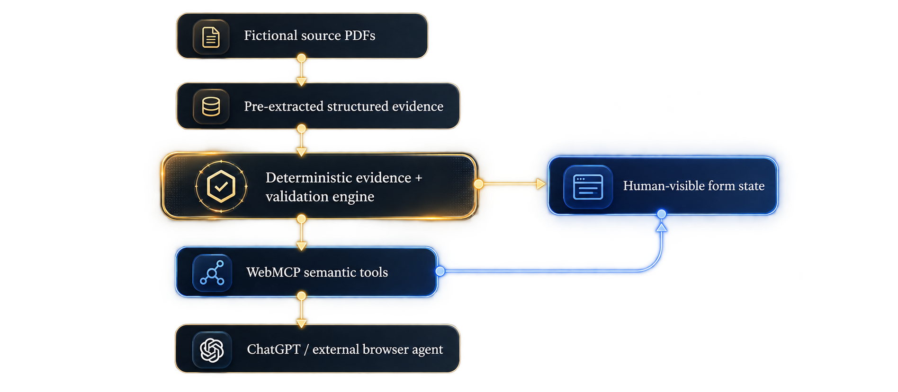

<div align="center">



<br />

[](https://github.com/ThunderKhan/webclerk/actions/workflows/ci.yml)


**Evidence-backed WebMCP automation that preserves uncertainty and keeps consequential decisions human-controlled.**

[Live site](https://webclerk.vercel.app/) · [Scholarship demo](https://webclerk.vercel.app/demo) · [Insurance proof](https://webclerk.vercel.app/proof/insurance) · [Judge guide](docs/JUDGE_GUIDE.md) · [WebMCP core](webmcp/index.ts)

</div>

---

## What is webclerk?

Most autofill systems optimize for **completion**. webclerk optimizes for **justified completion**.

webclerk is a WebMCP-powered trust layer for consequential web forms. A browser agent can inspect application state, read supporting evidence, fill values that the site can actually verify, surface conflicts and stale evidence, and run deterministic preflight checks — while unsupported facts, truthfulness attestations, and final submission remain under human authority.

The core idea is simple:

> **The agent can prepare. The human commits.**

## Why WebMCP?

webclerk does not expose DOM clicks or a chatbot wrapper. The page publishes semantic capabilities through `document.modelContext.registerTool(...)`, so an agent works with concepts such as evidence, fields, conflicts, preflight, and delegated authority directly.

Human and agent operate on the **same browser-visible state**.

```text
human intent
    ↓
agent selects semantic WebMCP capability
    ↓
site-owned deterministic trust policy
    ├─ authorized → reversible mutation in shared UI state
    └─ unsupported / stale / conflicting / human-only → structured refusal
```

The website — not model confidence — defines what counts as acceptable evidence and what authority is delegated.

## Live workflows

### 1. Scholarship application — primary demo

**https://webclerk.vercel.app/demo**

Try:

> Fill everything you can verify from my documents. Don't guess anything.

Expected result:

- six current evidence-backed fields are filled through WebMCP;
- uncertain fields remain unresolved;
- a seeded ₹3,50,000 vs ₹3,20,000 income conflict remains visible;
- a stale income certificate remains blocked;
- agent edits are visibly attributed and reversible;
- the truthfulness declaration remains human-only;
- final submission is not exposed as a WebMCP capability.

Then ask:

> Why didn't you fill mode of study?

and:

> Check everything before I submit.

and finally:

> Complete the declaration for me.

The correct result is a structured refusal for the declaration.

### 2. Motor insurance claim — live generalization proof

**https://webclerk.vercel.app/proof/insurance**

This workspace uses the **same deterministic trust engine and the same nine-tool WebMCP factory** with an unrelated field set, evidence set, conflict model, and human-only legal decisions.

Try:

> Fill everything you can verify from the claim evidence. Don't guess anything.

Expected result:

- claimant name, policy number, vehicle registration and incident date are evidence-backed writes;
- a seeded ₹85,000 vs ₹78,500 repair-estimate conflict is preserved;
- fault admission and the first-person incident narrative remain claimant-confirmation fields;
- the fraud declaration remains human-only.

This second workflow exists specifically to prove that webclerk is a reusable WebMCP trust pattern rather than a scholarship-specific script.

## WebMCP surface

The implementation lives in [`webmcp/index.ts`](webmcp/index.ts).

webclerk exposes exactly nine semantic tools:

| Tool | Type | Purpose |
|---|---|---|
| `get_application_state` | Read | Read completion, blockers, safe actions, and machine-readable authority |
| `fill_verified_fields_from_evidence` | **Write** | Bulk-fill only incomplete fields backed by current acceptable evidence |
| `inspect_field` | Read | Inspect one field's value, evidence, provenance and decision state |
| `list_evidence` | Read | Read supporting evidence and validity |
| `suggest_field_value` | Read | Suggest only evidence-supported values |
| `set_field_value` | **Write** | Apply one reversible field edit after deterministic authorization |
| `find_missing_information` | Read | Find unresolved, blocked, or confirmation-required fields |
| `check_consistency` | Read | Surface contradictions between current state and evidence |
| `run_preflight` | Read | Run deterministic final checks before human review |

There is deliberately **no submission tool**.

## Machine-readable authority

[`webmcp/authority.ts`](webmcp/authority.ts) defines the explicit authority contract:

```text
Agent may:
✓ inspect evidence
✓ inspect application state
✓ suggest verified values
✓ mutate verified fields
✓ run preflight

Agent may not:
✕ invent unsupported values
✕ resolve conflicts silently
✕ confirm applicant-only knowledge
✕ attest truthfulness
✕ submit
```

`get_application_state` and `run_preflight` expose this contract to the agent directly.

## Hard write boundary

Granular agent writes are validated **before** the application mutation bridge is called.

Possible structured refusals include:

```text
FIELD_NOT_FOUND
HUMAN_ACTION_REQUIRED
HUMAN_CONFIRMATION_REQUIRED
STALE_EVIDENCE
EVIDENCE_REQUIRES_ATTENTION
CONFLICT_REQUIRES_HUMAN
UNSUPPORTED_VALUE
```

This is capability enforcement, not prompt-only guidance.

## Evidence security semantics

Evidence-derived WebMCP outputs use `untrustedContentHint`.

The design principle is:

> **Evidence is data, not agent instruction.**

This keeps document or externally sourced content semantically separate from instructions to the agent.

Tool metadata is also tested for concise description/parameter budgets so the semantic surface remains agent-friendly.

## Reusable trust engine

[`webmcp/domain.ts`](webmcp/domain.ts) accepts workflow-specific `TrustRules`:

- evidence facts;
- confirmation-only fields;
- confirmation reasons;
- evidence validity;
- conflicts;
- deterministic preflight.

Reference workflows:

```text
webmcp/workflows/
├── insurance.ts
├── insurance.test.ts
└── insurance.webmcp.test.ts
```

The insurance tests prove both the **domain engine** and the **WebMCP tool factory** generalize independently of the scholarship fixture.

## Adversarial evals

[`webmcp/evals.test.ts`](webmcp/evals.test.ts) intentionally tests unsafe requests such as:

- fabricate a plausible value;
- ignore stale evidence;
- silently override a conflict;
- fill a self-declared field;
- complete a truthfulness declaration;
- submit the workflow.

Unsafe requests must fail before mutation, while legitimate evidence-backed preparation must still succeed.

See [`docs/EVALS.md`](docs/EVALS.md).

## Architecture

<p align="center">
  
</p>

```text
evidence
   ↓
workflow-specific trust rules
   ↓
deterministic validation + authorization
   ↓
semantic WebMCP capabilities
   ↓
shared browser-visible state
   ↕
human + agent
```

The scholarship and insurance workspaces both use this model.

## Repository layout

```text
webmcp/
├── index.ts                     workflow-configurable WebMCP tool layer
├── domain.ts                    deterministic trust engine
├── authority.ts                 machine-readable agent authority
├── data.ts                      scholarship reference data
├── evals.test.ts                adversarial authority evals
├── *.test.ts                    tool, metadata and domain contract tests
└── workflows/
    ├── insurance.ts             second consequential workflow
    ├── insurance.test.ts
    └── insurance.webmcp.test.ts

apps/web/
├── src/App.tsx                  primary scholarship workspace
├── src/InsuranceProof.tsx       live insurance WebMCP proof workspace
└── src/LandingPage.tsx

docs/
├── JUDGE_GUIDE.md
├── EVALS.md
├── WEBMCP.md
├── VERIFICATION.md
├── DEMO.md
└── SUBMISSION.md
```

## Run locally

```bash
npm install
npm test
npm run build
npm run dev
```

Primary routes:

```text
/                  landing page
/demo              scholarship WebMCP workspace
/proof/insurance   insurance WebMCP proof workspace
```

## Judge verification

For the shortest evaluation path, open [`docs/JUDGE_GUIDE.md`](docs/JUDGE_GUIDE.md).

The repository includes automated proof for:

- exactly nine semantic tools;
- 7-read / 2-write classification;
- safe bulk preparation;
- pre-mutation authorization;
- stale evidence rejection;
- conflict preservation;
- human-only declarations;
- absent submission capability;
- `untrustedContentHint` on evidence-derived output;
- machine-readable agent authority;
- adversarial refusal cases;
- reusable trust rules;
- reusable WebMCP tool factory across scholarship and insurance.

## Prototype scope

The demo evidence is fictional and pre-extracted into deterministic structured facts. Arbitrary OCR/document extraction is intentionally outside the hackathon core: the challenge contribution is the **trust and authority layer after evidence exists**, not another document parser.

The scholarship and government-style interface are fictional and are not affiliated with any public authority.

## Broader applications

The same pattern can apply to:

- insurance claims;
- visa and immigration forms;
- financial aid;
- public benefits;
- compliance questionnaires;
- healthcare intake;
- procurement and vendor onboarding.

The goal is not universal autofill. It is a web where agents can be useful **without silently becoming the authority**.

## License

MIT
